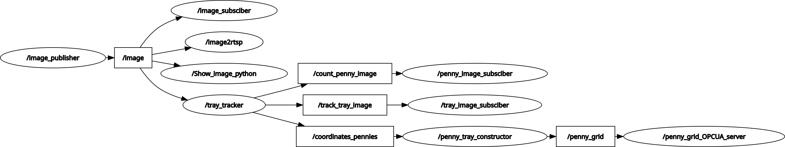

# TrayTracker_ROS2
A ROS2 system for tracking and counting objects processed as arrays.

<div align="center">
  
</div>

## Overview


<br>

## Executables

**ROS2_Ab_C++** 
- **penny_tray_constructor:** subscribes to `/coordinates_pennies` and publishes `/penny_grid`, a grid of set resolution filled with booleans representing object detection coordinates.

<br>

**ROS2_Ab_OPCUA**
- **penny_grid_server:** subscribes to `/penny_grid` and publishes `/penny_grid_OPCUA_server`, changes the values of a series of numbered boolean variables from a device according to the coordinates from `/penny_grid` through asynchronous OPC UA with set URL and variable path.

<br>

**ROS2_Ab_YOLO**
- **tracker_node**: subscribes to `/image` and publishes `/count_penny_image`, `/track_tray_image` and `/coordinates_pennies`, tracks and counts objects within a region.

<br>

**ROS2_Sarath18_OpenCV**
- **count_penny_image_show:** subscribes to `/count_penny_image` and shows the image.  
- **image_node:** publishes `/image`.  
- **image_show:** subscribes to `/image` and shows the image.  
- **track_tray_image_show:** subscribes to `/track_tray_image` and shows the image.  

<br>

**ROS2_marcos-moura97_Flask**
- **count_penny_image_web:** subscribes to `/count_penny_image` and streams its video as a webserver host.
- **image_web:** subscribes to `/image` and streams its video as a webserver host.
- **track_tray_image_web:** subscribes to `/track_tray_image` and streams its video as a webserver host.

<br>

## Installation
Make sure the following is installed:
- [ROS 2 Jazzy Jalisco](https://docs.ros.org/en/jazzy/Installation/Ubuntu-Install-Debs.html)
```bash
$ lsb_release -a
No LSB modules are available.
Distributor ID:	Ubuntu
Description:	Ubuntu 24.04.1 LTS
Release:	24.04
Codename:	noble

$ printenv | grep ROS_DISTRO
ROS_DISTRO=jazzy

$ python3 --version
Python 3.12.3

$ git clone https://github.com/AbdielAlfonsoRinconCantu/TrayTracker_ROS2.git
$ cd ~/TrayTracker_ROS2

$ sudo apt update
$ sudo apt install -y $(cat packages.list)

$ pip install -r global_requirements.txt 
```
<br>

## Building packages
**ROS2_Ab_C++**
```bash
$ cd ~/TrayTracker_ROS2/ROS2_Ab_C++/ros2_ws
$ source /opt/ros/jazzy/setup.bash
$ colcon build --cmake-clean-cache
```
<br>

**ROS2_Ab_OPCUA**
```bash
$ cd ~/TrayTracker_ROS2/ROS2_Ab_OPCUA
$ python3.12 -m venv ROS2_Ab_OPCUA_venv
$ source ~/ROS2_Ab_OPCUA/ROS2_Ab_OPCUA_venv/bin/activate
$ pip install -r ROS2_Ab_OPCUA_venv_requirements.txt
```

On a new terminal:
```bash
$ cd ~/TrayTracker_ROS2/ROS2_Ab_OPCUA/ros2_ws
$ source /opt/ros/jazzy/setup.bash
$ source ~/ROS2_Ab_OPCUA/ROS2_Ab_OPCUA_venv/bin/activate
$ colcon build --cmake-clean-cache
```
<br>

**ROS2_Ab_YOLO**
```bash
$ cd ~/TrayTracker_ROS2/ROS2_Ab_YOLO
$ python3.12 -m venv ROS2_Ab_YOLO_venv
$ source ~/ROS2_Ab_YOLO/ROS2_Ab_YOLO_venv/bin/activate
$ pip install -r ROS2_Ab_YOLO_requirements.txt
```

On a new terminal:
```bash
$ cd ~/TrayTracker_ROS2/ROS2_Ab_YOLO/ros2_ws
$ source /opt/ros/jazzy/setup.bash
$ source ~/ROS2_Ab_YOLO/ROS2_Ab_YOLO_venv/bin/activate
$ colcon build --cmake-clean-cache
```
<br>

**ROS2_Sarath18_OpenCV**
```bash
$ cd ~/TrayTracker_ROS2/ROS2_Sarath18_OpenCV/ros2_ws
$ source /opt/ros/jazzy/setup.bash
$ colcon build --cmake-clean-cache
```
<br>

**ROS2_marcos-moura97_Flask**
```bash
$ cd ~/TrayTracker_ROS2/ROS2_marcos-moura97_Flask/ros2_ws
$ source /opt/ros/jazzy/setup.bash
$ colcon build --cmake-clean-cache
```
<br>

**ROS2_xovobobo_RTSP**
```bash
$ cd ~/TrayTracker_ROS2/ROS2_xovobobo_RTSP/ros2_ws
$ source /opt/ros/jazzy/setup.bash
$ colcon build --cmake-clean-cache
```

## Usage 

**ROS2_Ab_C++**
```bash
$ cd ~/TrayTracker_ROS2/ROS2_Ab_C++/ros2_ws
$ source install/setup.bash
$ ros2 run ros2_penny_constructor penny_tray_constructor
```
<br>

**ROS2_Ab_OPCUA**
```bash
$ cd ~/TrayTracker_ROS2/ROS2_Ab_OPCUA/ros2_ws
$ source install/setup.bash
$ source ~/ROS2_Ab_OPCUA/ROS2_Ab_OPCUA_venv/bin/activate
$ export PYTHONPATH='/opt/ros/jazzy/lib/python3.12/site-packages:~/ROS2_Ab_OPCUA/ros2_ws/install/ros2_opcua/lib/python3.12/site-packages:~/ROS2_Ab_OPCUA/ROS2_Ab_OPCUA_venv/lib/python3.12/site-packages'
$ ros2 run ros2_opcua penny_grid_server
```
<br>

**ROS2_Ab_YOLO**
```bash
$ cd ~/TrayTracker_ROS2/ROS2_Ab_YOLO/ros2_ws
$ source install/setup.bash
$ source ~/ROS2_Ab_YOLO/ROS2_Ab_YOLO_venv/bin/activate
$ export PYTHONPATH='/opt/ros/jazzy/lib/python3.12/site-packages:~/ROS2_Ab_YOLO/ros2_ws/install/ros2_tracking/lib/python3.12/site-packages:~/ROS2_Ab_YOLO/ROS2_Ab_YOLO_venv/lib/python3.12/site-packages'
$ ros2 run ros2_tracking tracker_node
```
<br>

**ROS2_Sarath18_OpenCV**
```bash
$ cd ~/TrayTracker_ROS2/ROS2_Sarath18_OpenCV/ros2_ws
$ source install/setup.bash
$ ros2 run ros2_opencv <executable>
```

<br>

**ROS2_marcos-moura97_Flask**
```bash
$ cd ~/TrayTracker_ROS2/ROS2_marcos-moura97_Flask/ros2_ws
$ source install/setup.bash
$ ros2 run video_stream_ros2 <your_node>
```
On a new terminal:
```bash
$ cd ~/TrayTracker_ROS2/ROS2_marcos-moura97_Flask/ros2_ws/src/video_stream_ros2/video_stream_ros2
$ gunicorn --threads 4 --workers 2 --bind <your_IP_address>:<your_port> <your_app>:app
```
app → `/image`  
app_2 → `/track_tray_image`  
app_3 → `/penny_count_image` 

<br>

**ROS2_xovobobo_RTSP**
```bash
$ cd ~/TrayTracker_ROS2/ROS2_xovobobo_RTSP/ros2_ws
$ source install/setup.bash
$ ros2 launch image2rtsp image2rtsp.launch.py 
```

<br>

**launcher.sh**
```bash
$ cd ~/TrayTracker_ROS2
$ ./launcher.sh
```

<br>

## Acknowledgments

- Sarath18 / video.py: https://gist.github.com/Sarath18/7c48b6f2e667bf6dab1b12f419cab397
- marcos-moura97 / video_stream_ros2 : https://github.com/marcos-moura97/video_stream_ros2
- xovobobo / image2rtsp : https://github.com/xovobobo/image2rtsp
